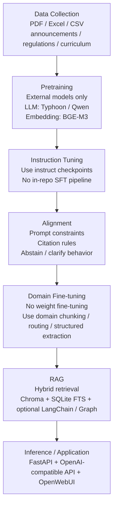
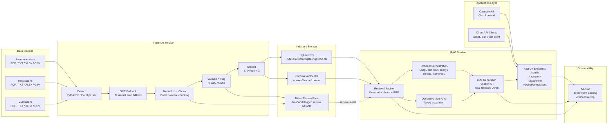

# CPE-CHAT Project Pipeline Assessment

เอกสารนี้สรุป pipeline ของโปรเจคตามลำดับที่ต้องการ:

Data collection
↓
Pretraining
↓
Instruction tuning
↓
Alignment
↓
Domain fine-tuning
↓
RAG
↓
Inference / Application

จุดสำคัญคือ โปรเจคนี้ไม่ได้สร้าง foundation model เองตั้งแต่ศูนย์ แต่เป็นระบบ RAG application ที่นำ pretrained / instruction-tuned model ภายนอกมาใช้ แล้วเพิ่ม domain adaptation, retrieval, prompting, guardrails, และ deployment layer เข้าไป

## 1. Visual Pipeline

## 1.1 Real System Architecture

ภาพนี้คือสถาปัตยกรรมที่ระบบใช้งานจริงใน repo ปัจจุบัน โดยแยกให้เห็นชัดว่าฝั่ง ingestion สร้าง indexes ก่อน แล้ว `rag-service` จึงนำ index เหล่านั้นไปใช้ในการตอบคำถามผ่าน OpenWebUI หรือ API client อื่น ๆ

## 2. Executive Summary

| Stage | สิ่งที่โปรเจคทำจริง | สถานะ | ผลล่าสุด | ประเมิน |
|---|---|---|---|---|
| Data collection | ingest เอกสาร 3 โดเมน, OCR fallback, chunking, index | Done | มี pipeline ครบ | น่าพอใจระดับระบบ ingestion |
| Pretraining | ใช้โมเดลภายนอก ไม่ได้ pretrain เอง | External only | ไม่มี metric การ pretrain ใน repo | ประเมินไม่ได้ในฐานะงานที่ทีมทำเอง |
| Instruction tuning | ใช้ instruct model สำเร็จรูป | External only | ไม่มี SFT dataset/checkpoint ใน repo | ประเมินไม่ได้ในฐานะงานที่ทีมทำเอง |
| Alignment | ทำในระดับ prompt/guardrails ไม่ใช่ RLHF/DPO | Partial | offline answer-eval ดี แต่ live-eval ยังมี hallucination | ยังไม่น่าพอใจเต็มที่ |
| Domain fine-tuning | ไม่มี LoRA / full fine-tune; ใช้ domain engineering แทน | Partial | ดีขึ้นผ่าน retrieval orchestration | พอใช้ แต่ยังไม่ใช่ true fine-tuning |
| RAG | hybrid retrieval + optional LangChain/Graph | Done | บางชุดได้ 29/30 ถึง 30/30, แต่ retrieval/live eval ยังแกว่ง | ดีใน targeted eval, ยังต้อง improve robustness |
| Inference / Application | FastAPI + OpenWebUI + OpenAI-compatible endpoint | Done | deploy ได้จริง | น่าพอใจ |

## 3. Stage-by-Stage Assessment

### 3.1 Data Collection

สิ่งที่ระบบทำ:

- รับข้อมูลจาก PDF, Excel, CSV, TXT
- แยกโดเมนเป็น `announcements`, `regulations`, `curriculum`
- ใช้ PyMuPDF อ่าน text layer และ fallback ไป OCR ด้วย Tesseract เมื่อคุณภาพต่ำ
- ทำ chunking แบบ paragraph/sentence aware และมี strategy เฉพาะโดเมน
- เก็บผลลง SQLite FTS สำหรับ keyword search และ Chroma สำหรับ vector search

สิ่งที่มีหลักฐานใน repo:

- ingestion README ระบุ pipeline OCR + chunk + store ชัดเจน
- โค้ด ingestion ใช้ `auto | poppler | tesseract` เป็น OCR engine หลัก
- มีโครงสร้าง index แยกตามโดเมนใน `indexes/<domain>/...`

สถานะ:

- Done

ผลที่เห็น:

- ระบบเตรียม knowledge base ได้ครบทั้ง 3 โดเมน
- รองรับเอกสารสแกนและเอกสาร text-layer
- มี flagged review path สำหรับเอกสารคุณภาพต่ำ

ข้อสรุป:

- ขั้นนี้ถือว่าทำได้ดีและเป็นฐานที่ใช้งานจริงได้แล้ว
- จุดที่ต้องระวังคือคุณภาพ OCR และคุณภาพ chunking จะส่งผลต่อ retrieval downstream โดยตรง

### 3.2 Pretraining

สิ่งที่ระบบใช้:

- Embedding model: `BAAI/bge-m3`
- LLM deployed path: `typhoon-v2.5-30b-a3b-instruct` ผ่าน Typhoon API
- Local fallback/dev path: `Qwen/Qwen2.5-7B-Instruct`

สิ่งที่โปรเจคไม่ได้ทำ:

- ไม่มี corpus pretraining
- ไม่มี tokenizer training
- ไม่มี checkpoint training จาก scratch

สถานะ:

- External only

ผลที่เห็น:

- ได้ประโยชน์จาก multilingual embedding และ Thai-capable instruct LLM ทันที
- แต่ไม่สามารถ claim ว่าทีมพัฒนา pretraining quality เองได้

ข้อสรุป:

- ถ้านำเสนอ pipeline แบบมาตรฐาน LLM ต้องระบุชัดว่า step นี้ “ใช้โมเดลภายนอก” ไม่ใช่ “ทีมทำเสร็จแล้ว”

### 3.3 Instruction Tuning

สิ่งที่ระบบใช้:

- ใช้ instruct checkpoints สำเร็จรูปจาก provider/model family ที่เลือก
- การตอบถูกควบคุมเพิ่มด้วย prompt template, system instruction, และ answer formatting

สิ่งที่โปรเจคไม่ได้ทำ:

- ไม่มี supervised fine-tuning pipeline
- ไม่มี instruction dataset ภายใน repo สำหรับ train model
- ไม่มี training config ของ LoRA/SFT หรือ trainer logs

สถานะ:

- External only

ผลที่เห็น:

- ตัวโมเดลตอบเชิง instruction ได้ทันที เพราะใช้ instruct model อยู่แล้ว
- แต่ยังไม่สามารถวัดผล step นี้แยกจากตัว provider ได้

ข้อสรุป:

- ในโปรเจคนี้ instruction-following มาจาก model vendor เป็นหลัก ไม่ใช่ผลจาก training step ที่ทีมทำเอง

### 3.4 Alignment

สิ่งที่ระบบทำจริง:

- เพิ่ม system prompt บังคับให้ใช้ข้อมูลจากบริบทเท่านั้น
- บังคับให้ถามกลับเมื่อคำถามกำกวม
- มี citation enforcement option
- มี guardrail behavior สำหรับกรณีที่เอกสารไม่ได้กล่าวตรง ๆ

สิ่งที่โปรเจคไม่ได้ทำ:

- ไม่มี RLHF
- ไม่มี DPO
- ไม่มี reward model
- ไม่มี preference dataset/trainer

สถานะ:

- Partial, but only at application layer

ผลที่เห็น:

- Answer eval บางชุดออกมาดีมาก เช่น 30/30 ใน targeted evaluation
- แต่ live eval ล่าสุดยังมีปัญหา calibration ชัดเจน:
  - answerable cases 28
  - hallucinations 2
  - false negatives 6
  - false negative rate 0.2143

ข้อสรุป:

- ระบบมี alignment เชิง prompt/guardrail แล้ว
- แต่ยังไม่ถึงระดับ robust alignment เพราะยังมีทั้ง hallucination และ abstain ผิดจังหวะ

### 3.5 Domain Fine-tuning

สิ่งที่ระบบทำจริง:

- ใช้ domain-specific chunking strategy
- ใช้ domain routing (`announcements`, `regulations`, `curriculum`)
- มี structured curriculum extraction สำหรับโจทย์เชิงหลักสูตร
- มี query normalization, typo fixing, bilingual augmentation, course-code expansion
- มี optional Graph RAG และ LangChain orchestration

สิ่งที่โปรเจคไม่ได้ทำ:

- ไม่มี weight fine-tuning ของ LLM
- ไม่มี LoRA adapter
- ไม่มี domain continued pretraining

สถานะ:

- Partial, implemented as domain adaptation rather than model fine-tuning

ผลที่เห็น:

- คุณภาพตอบ domain questions ดีขึ้นชัดใน targeted answer-eval
- retrieval accuracy ยังมีเคสที่ top-1 พลาด โดยเฉพาะบางคำถามใน announcements และ curriculum

ข้อสรุป:

- ถ้าพูดตามนิยาม ML แบบเข้มงวด ขั้นนี้ยังไม่ใช่ domain fine-tuning
- ถ้าพูดเชิงระบบใช้งานจริง ถือว่าเป็น domain adaptation layer ที่ทำงานแทน fine-tuning ไปมากแล้ว

### 3.6 RAG

สิ่งที่ระบบทำจริง:

- vector retrieval จาก Chroma
- keyword retrieval จาก SQLite FTS
- รวมผลแบบ hybrid และจัดอันดับด้วย RRF
- pack context ตาม token budget
- build prompt แล้วส่งไป LLM
- มี optional LangChain mode:
  - multi-query retrieval
  - rerank
  - context compression
  - structured / route / citation enforcement options
- มี optional graph expansion จาก Neo4j

สถานะ:

- Done

ผลที่เห็นจากรายงาน:

- Retrieval-only eval ยังมี query ที่ top-1 ไม่ตรง expected keyword หลายเคส
- Answer eval แบบ targeted ทำได้ดีมาก:
  - `answer_eval_compare_langchain_multiquery_nocite.md`: 30/30
  - `answer_eval_compare_langchain_nocite.md`: 29/30
  - `answer_eval_langchain_strict_5_v2.md`: 15/15
- แต่ live eval ล่าสุดยังไม่นิ่ง:
  - total 30
  - hallucinations 2
  - false negatives 6
  - answerable accuracy heuristic 0.0

ข้อสรุป:

- RAG pipeline คือหัวใจของสิ่งที่ทีมทำสำเร็จจริงในโปรเจคนี้
- คุณภาพดีมากใน curated / targeted benchmark
- แต่ยังต้องเพิ่ม robustness ใน real-world evaluation โดยเฉพาะ retrieval precision และ abstention calibration

### 3.7 Inference / Application

สิ่งที่ระบบทำจริง:

- เปิด API หลักคือ `/rag/query`, `/rag/answer`, `/v1/chat/completions`
- เชื่อม OpenWebUI ผ่าน OpenAI-compatible endpoint
- deploy ได้ผ่าน Docker Compose
- มี health check และ service separation ชัดเจน

สถานะ:

- Done

ผลที่เห็น:

- ใช้งานเป็น production-style demo/application ได้จริง
- รองรับทั้ง direct API และ chat UI

ข้อสรุป:

- ขั้น application ถือว่าพร้อมที่สุดใน pipeline ทั้งหมด
- ความเสี่ยงหลักไม่ได้อยู่ที่ UI หรือ serving layer แต่อยู่ที่ retrieval/alignment quality upstream

## 4. Result Snapshot

### 4.1 จุดที่ทำได้ดี

- ingestion pipeline ครบตั้งแต่เอกสารดิบไปจนถึง vector + keyword index
- deploy path ชัดเจนและใช้งานได้จริงผ่าน FastAPI + OpenWebUI
- targeted answer-eval หลายชุดอยู่ในระดับสูงมาก
- LangChain multi-query path ช่วยดันผล answer-eval ไปถึง 30/30

### 4.2 จุดที่ยังไม่พอใจ

- retrieval-only quality ยังไม่เสถียรในบาง query
- live evaluation ยังเจอ hallucination และ false negative
- ยังไม่มี true training pipeline สำหรับ pretraining / SFT / RLHF / DPO / LoRA

### 4.3 สรุปแบบสั้นที่สุด

- ถ้ามองเป็น “LLM training pipeline” โปรเจคนี้ทำถึง Data collection, RAG, Inference ชัดเจนที่สุด
- ถ้ามองเป็น “application pipeline” โปรเจคนี้ทำได้ถึงระดับใช้งานจริงแล้ว
- จุดที่ยังขาดคือ training-layer adaptation ของตัวโมเดลเอง และ robustness ของ live behavior

## 5. Recommended Presentation Script

เวลานำเสนอสามารถพูดแบบนี้ได้ตรงและไม่เกินจริง:

> โปรเจค CPE-CHAT ไม่ได้ฝึก foundation model เองตั้งแต่ pretraining แต่เลือกใช้ pretrained และ instruction-tuned model ภายนอก ได้แก่ Typhoon สำหรับ generation และ BGE-M3 สำหรับ embeddings จากนั้นทีมพัฒนา data pipeline, domain adaptation, hybrid RAG, guardrails, และ application layer เองทั้งหมด
>
> ผลคือระบบตอบคำถามเชิงเอกสารในชุดทดสอบเฉพาะทางได้ดีมาก แต่เมื่อประเมินแบบ live ยังพบปัญหา hallucination และ false negative อยู่ จึงสรุปได้ว่าระบบพร้อมใช้งานในระดับ prototype/production-like application แล้ว แต่ยังควรปรับ retrieval robustness และ answer calibration ต่อก่อนจะสรุปว่าคุณภาพน่าพอใจเต็มที่ทุกมิติ

## 6. Bottom Line

ถ้าประเมินตาม pipeline ที่ร้องขอ:

- Data collection: ดี
- Pretraining: ไม่ได้ทำเอง
- Instruction tuning: ไม่ได้ทำเอง
- Alignment: ทำบางส่วนในระดับ prompt/guardrail แต่ยังไม่พอ
- Domain fine-tuning: ยังไม่ใช่ fine-tuning จริง เป็น domain adaptation
- RAG: ทำได้ดีและเป็นแกนหลักของโปรเจค
- Inference / Application: พร้อมใช้งาน

ดังนั้นคำตอบที่ตรงที่สุดคือ โปรเจคนี้เก่งในส่วน “knowledge pipeline + RAG application” มากกว่า “model training pipeline”